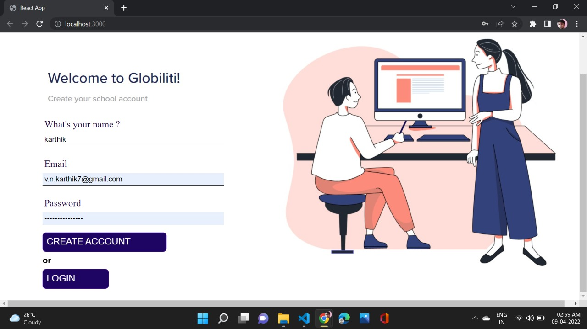
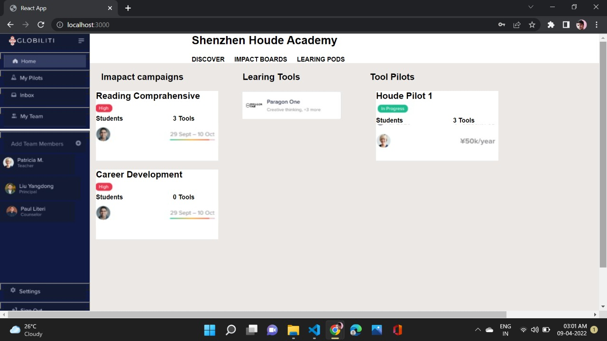

# Assignment-

How to run the program :-

Step 1:- Down load the repository and go the folder 
```
cd Assignment--main
```
 
Step 2:-   Install npm modules

```
npm i 
```

Step 3 :-  Now run the MongoDB.js file for database
```
node MongoDB.js
```

Step 4:- Now open another aother terminal and go to login folder

```
cd Assignment--main/login
```

Step 5:- Now again install npm modules 
```
npm i 
```

Step 6:- Finally run the application

```
npm start
```


Output Images :- 

1. Below is the home page where user can register or click on login to go to login page


2. This is login page 


3. This is the main home page 



